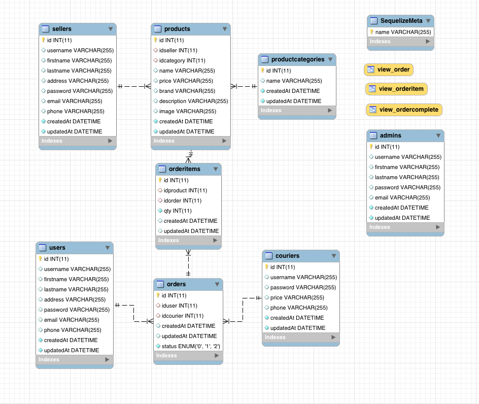

# UKMKITA

## Database name `ukmkita`

## Tables

```
mysql> show tables;
+-------------------+
| Tables_in_ukmkita |
+-------------------+
| Admins            |
| Couriers          |
| orderItems        |
| Orders            |
| productCategories |
| Products          |
| Sellers           |
| SequelizeMeta     |
| Users             |
+-------------------+
```

## db Design




## DESC Products table

```
mysql> desc Products;
+-------------+--------------+------+-----+---------+----------------+
| Field       | Type         | Null | Key | Default | Extra          |
+-------------+--------------+------+-----+---------+----------------+
| id          | int(11)      | NO   | PRI | NULL    | auto_increment |
| idseller    | int(11)      | YES  | MUL | NULL    |                |
| idcategory  | int(11)      | YES  | MUL | NULL    |                |
| name        | varchar(255) | YES  |     | NULL    |                |
| price       | varchar(255) | YES  |     | NULL    |                |
| brand       | varchar(255) | YES  |     | NULL    |                |
| description | varchar(255) | YES  |     | NULL    |                |
| image       | varchar(255) | YES  |     | NULL    |                |
| createdAt   | datetime     | NO   |     | NULL    |                |
| updatedAt   | datetime     | NO   |     | NULL    |                |
+-------------+--------------+------+-----+---------+----------------+
```

## DESC productCategory table

```
+--------------+--------------+------+-----+---------+----------------+
| Field        | Type         | Null | Key | Default | Extra          |
+--------------+--------------+------+-----+---------+----------------+
| id           | int(11)      | NO   | PRI | NULL    | auto_increment |
| name         | varchar(255) | YES  |     | NULL    |                |
| createdAt    | datetime     | NO   |     | NULL    |                |
| updatedAt    | datetime     | NO   |     | NULL    |                |
+--------------+--------------+------+-----+---------+----------------+
```

## DESC Users table

```
+-----------+--------------+------+-----+---------+----------------+
| Field     | Type         | Null | Key | Default | Extra          |
+-----------+--------------+------+-----+---------+----------------+
| id        | int(11)      | NO   | PRI | NULL    | auto_increment |
| username  | varchar(255) | YES  |     | NULL    |                |
| firstname | varchar(255) | YES  |     | NULL    |                |
| lastname  | varchar(255) | YES  |     | NULL    |                |
| address   | varchar(255) | YES  |     | NULL    |                |
| password  | varchar(255) | YES  |     | NULL    |                |
| email     | varchar(255) | YES  |     | NULL    |                |
| phone     | varchar(255) | YES  |     | NULL    |                |
| createdAt | datetime     | NO   |     | NULL    |                |
| updatedAt | datetime     | NO   |     | NULL    |                |
+-----------+--------------+------+-----+---------+----------------+
```

## DESC Sellers table

```
+-----------+--------------+------+-----+---------+----------------+
| Field     | Type         | Null | Key | Default | Extra          |
+-----------+--------------+------+-----+---------+----------------+
| id        | int(11)      | NO   | PRI | NULL    | auto_increment |
| username  | varchar(255) | YES  |     | NULL    |                |
| firstname | varchar(255) | YES  |     | NULL    |                |
| lastname  | varchar(255) | YES  |     | NULL    |                |
| address   | varchar(255) | YES  |     | NULL    |                |
| password  | varchar(255) | YES  |     | NULL    |                |
| email     | varchar(255) | YES  |     | NULL    |                |
| phone     | varchar(255) | YES  |     | NULL    |                |
| createdAt | datetime     | NO   |     | NULL    |                |
| updatedAt | datetime     | NO   |     | NULL    |                |
+-----------+--------------+------+-----+---------+----------------+
```

## DESC Admin table

```
mysql> desc Admins;
+-----------+--------------+------+-----+---------+----------------+
| Field     | Type         | Null | Key | Default | Extra          |
+-----------+--------------+------+-----+---------+----------------+
| id        | int(11)      | NO   | PRI | NULL    | auto_increment |
| username  | varchar(255) | YES  |     | NULL    |                |
| firstname | varchar(255) | YES  |     | NULL    |                |
| lastname  | varchar(255) | YES  |     | NULL    |                |
| password  | varchar(255) | YES  |     | NULL    |                |
| email     | varchar(255) | YES  |     | NULL    |                |
| createdAt | datetime     | NO   |     | NULL    |                |
| updatedAt | datetime     | NO   |     | NULL    |                |
+-----------+--------------+------+-----+---------+----------------+
8 rows in set (0.00 sec)
```

## DESC Courier table

```
mysql> desc Couriers;
+-----------+--------------+------+-----+---------+----------------+
| Field     | Type         | Null | Key | Default | Extra          |
+-----------+--------------+------+-----+---------+----------------+
| id        | int(11)      | NO   | PRI | NULL    | auto_increment |
| username  | varchar(255) | YES  |     | NULL    |                |
| password  | varchar(255) | YES  |     | NULL    |                |
| price     | varchar(255) | YES  |     | NULL    |                |
| phone     | varchar(255) | YES  |     | NULL    |                |
| createdAt | datetime     | NO   |     | NULL    |                |
| updatedAt | datetime     | NO   |     | NULL    |                |
+-----------+--------------+------+-----+---------+----------------+
```

## DESC orderItem table

```
mysql> desc orderItems;
+-----------+------------+------+-----+---------+----------------+
| Field     | Type       | Null | Key | Default | Extra          |
+-----------+------------+------+-----+---------+----------------+
| id        | int(11)    | NO   | PRI | NULL    | auto_increment |
| idproduct | int(11)    | YES  | MUL | NULL    |                |
| idcourier | int(11)    | YES  | MUL | NULL    |                |
| total     | bigint(20) | NO   |     | NULL    |                |
| createdAt | datetime   | NO   |     | NULL    |                |
| updatedAt | datetime   | NO   |     | NULL    |                |
+-----------+------------+------+-----+---------+----------------+
```

## DESC Orders table

```
mysql> desc Orders;
+-------------+----------+------+-----+---------+----------------+
| Field       | Type     | Null | Key | Default | Extra          |
+-------------+----------+------+-----+---------+----------------+
| id          | int(11)  | NO   | PRI | NULL    | auto_increment |
| iduser      | int(11)  | YES  | MUL | NULL    |                |
| idorderitem | int(11)  | YES  | MUL | NULL    |                |
| idcourier   | int(11)  | YES  | MUL | NULL    |                |
| createdAt   | datetime | NO   |     | NULL    |                |
| updatedAt   | datetime | NO   |     | NULL    |                |
+-------------+----------+------+-----+---------+----------------+
```


## Showing product category

### Query

```sql
mysql> select Products.name, productCategories.nameCategory
from Products, productCategories
where Products.idcategory = productCategories.id;
```

```
+-------------------+--------------+
| name              | nameCategory |
+-------------------+--------------+
| Tempe             | cemilan      |
| Melayu Tea        | minuman      |
| Tenun Motif Batam | kerajinan    |
+-------------------+--------------+
3 rows in set (0.00 sec)
```

## Showing product by 1 category

### Query

```sql
mysql> select Products.name, productCategories.nameCategory
    -> from Products, productCategories
    -> where productCategories.id = Products.idcategory
    -> and productCategories.id = 5;
```

```
+-------+--------------+
| name  | nameCategory |
+-------+--------------+
| Tempe | cemilan      |
+-------+--------------+
1 row in set (0.00 sec)
```

### REST API Endpoints

User routes

| Endpoint          | HTTP   | Description              |
| ------------------| ------ | -------------------------|
| `/users`          | GET    | Get all users            |
| `/users/register` | POST   | Create new users         |
| `/users/login`    | POST   | users login              |


## Create view tables

```
CREATE 
    ALGORITHM = UNDEFINED 
    DEFINER = `indr`@`localhost` 
    SQL SECURITY DEFINER
VIEW `view_order` AS
    SELECT 
        `a`.`id` AS `idOrder`,
        `d`.`username` AS `username`,
        SUM((`c`.`price` * `b`.`qty`)) AS `total`
    FROM
        (((`orders` `a`
        LEFT JOIN `orderitems` `b` ON ((`a`.`id` = `b`.`idorder`)))
        LEFT JOIN `products` `c` ON ((`c`.`id` = `b`.`idproduct`)))
        LEFT JOIN `users` `d` ON ((`d`.`id` = `a`.`iduser`)))
    GROUP BY `a`.`id` , `d`.`username`
```

```
CREATE 
    ALGORITHM = UNDEFINED 
    DEFINER = `indr`@`localhost` 
    SQL SECURITY DEFINER
VIEW `view_orderitem` AS
    SELECT 
        `b`.`idorder` AS `idorder`,
        `c`.`name` AS `name`,
        `c`.`price` AS `price`,
        `b`.`qty` AS `qty`,
        (`c`.`price` * `b`.`qty`) AS `total`
    FROM
        (`orderitems` `b`
        LEFT JOIN `products` `c` ON ((`c`.`id` = `b`.`idproduct`)))
```